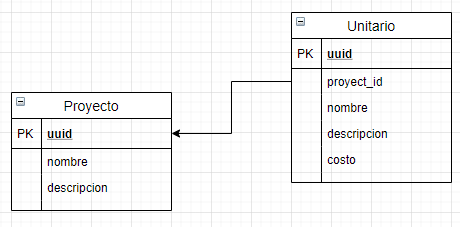

# GESTION DE PROECTOS

este es un repositorio que facilita el calculo de costos asociados a acciones unitarias dentro de un proyecto 

## Instalacion

- descargar el repositorio
- crear el entorno virtual y activar
- correr migracion y crear super usuario
- correr el servidor


### Descargar el repositorio

```
git clone https://github.com/ysanchez12/gestion_proyectos.git
```

### Crear el entorno virtual y activar
```
pip install virtualenv
virtualenv venv
venv\Scripts\activate
```

### Correr migracion y crear super usuario
```
python manage.py migrate
python manage.py createsueperuser
```

### Correr el servidor
```
python manage.py runserver
```


## Modelo
un proyecto se forma a partir de una serie de actividades con un valor asociado, este programa permite agilizar el calculo de presupuestos por proyecto segun actividad.


